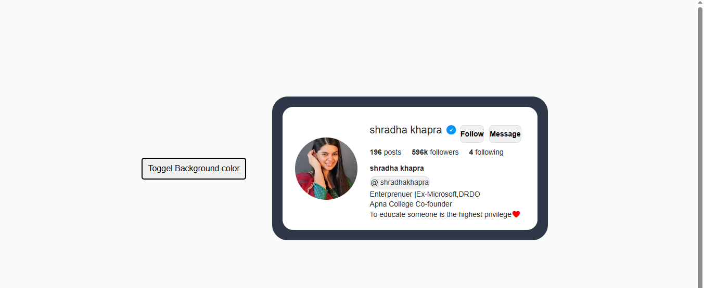
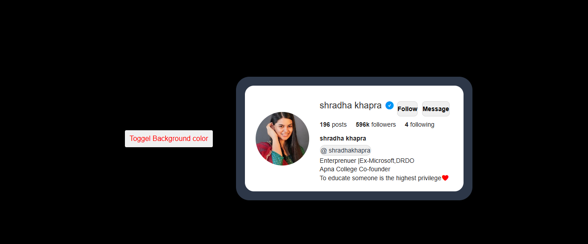

## About
This project is a web-based Instagram profile clone of Shradha Ma’am, developed using HTML, CSS, and JavaScript. The application demonstrates basic front-end interactivity, including dynamic UI updates and event handling.
Users can toggle the background color of the profile, and the follower count increases dynamically up to a predefined maximum limit. Once this limit is reached, the follower count remains constant, simulating real-world application behavior.

 ## Features
Instagram-style profile layout
Background color toggle functionality
Dynamic follower count with maximum limit
Responsive and clean user interface

 ## Technologies Used
HTML – Structure of the web page
CSS – Styling and layout design
JavaScript – Dynamic behavior and interactivity

## Output Screenshots
Default View 

Background Color Toggle

